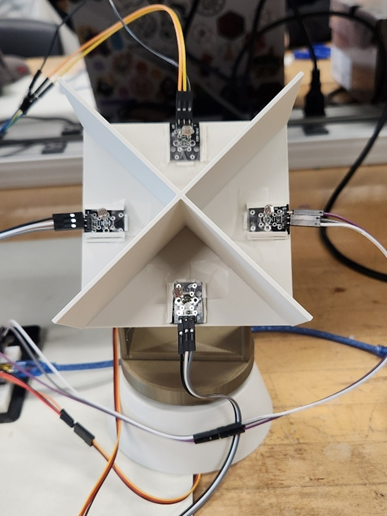

# ☀️ Automated Solar Tracker

This project is a dual-axis solar tracking system designed to optimize solar panel alignment with the sun. The system uses **photoresistors (LDRs)** to detect the direction of maximum light intensity and **servo motors** to adjust the panel’s orientation accordingly. A **GY-521 accelerometer-gyroscope module** monitors the tilt angle in real time for added feedback.

---

## 🔧 Features

- Dual-axis rotation (tilt and azimuth)
- Real-time light tracking using four photoresistors
- Tilt monitoring using the MPU6050 gyroscope
- 3D-printed frame for stability and modularity
- Arduino Nano microcontroller-based control logic
- Smooth servo movements with response thresholding

